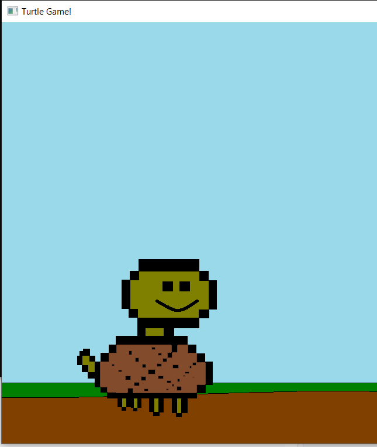

# Turtle Game

Uses the SFML (Simple and Fast Multimedia Library) game engine to run a simple game coded in C++

I made this during a break from school as a way to play around with user interface/graphics output in a simple way

Built in Visual Studio 2019, to develop open TurtleGame.vcxproj with Visual Studio.

